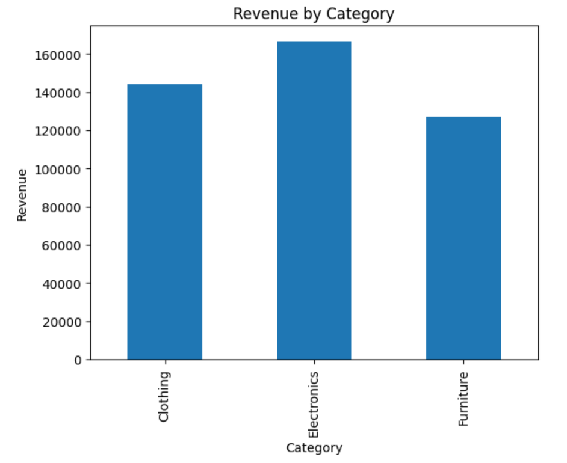
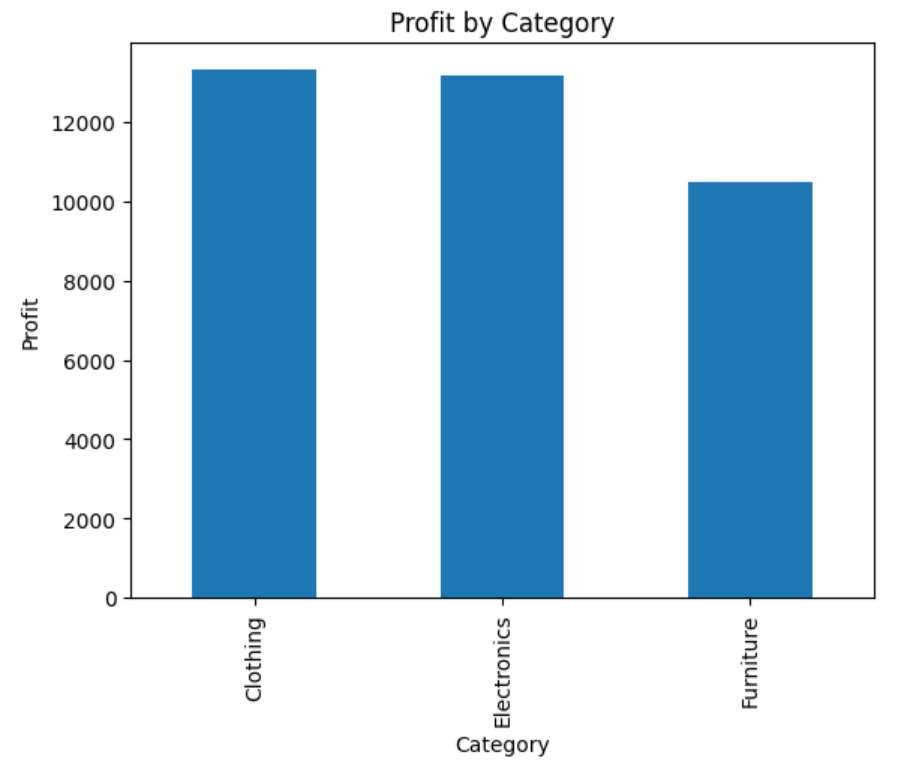
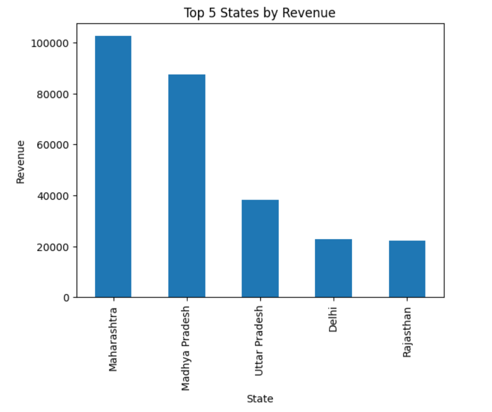
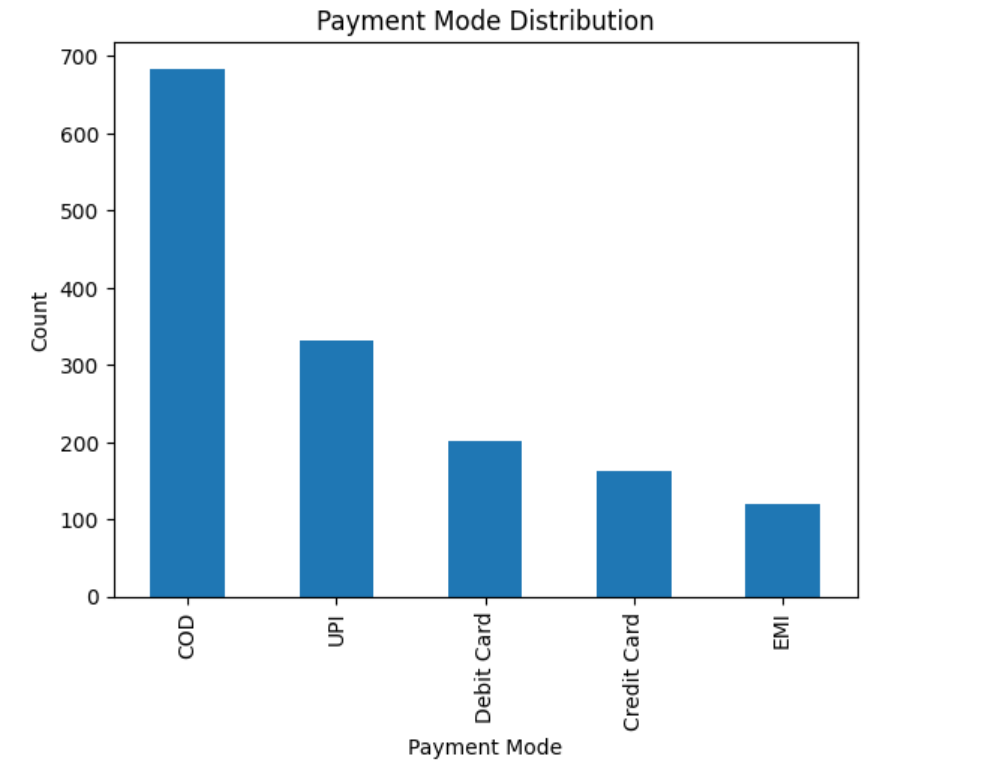

# E-Commerce Sales Analysis using Python

## Project Overview

This project analyzes e-commerce sales data using Python, Pandas, and Matplotlib.

The goal is to identify revenue trends, profit drivers, customer behavior, product performance, and payment preferences through data analysis and visualization.

---

## Tools & Technologies

* Python
* Pandas
* Matplotlib
* Jupyter Notebook

---

## Dataset

### Orders.csv

Contains:

* Order ID
* Order Date
* CustomerName
* State
* City

### Details.csv

Contains:

* Order ID
* Amount
* Profit
* Quantity
* Category
* Sub-Category
* PaymentMode

---

## Project Structure

ecommerce-sales-analysis/

- data/
  - Orders.csv
  - Details.csv

- notebooks/
  - ecommerce_analysis.ipynb

- screenshots/
  - category_revenue.png
  - category_profit.png
  - top5_states_revenue.png
  - payment_mode_distribution.png

- report/
  - ecommerce_sales_report.md

- requirements.txt

- README.md

---

## Analysis Performed

* Revenue Analysis
* Profit Analysis
* Customer Analysis
* State Analysis
* Product Analysis
* Payment Mode Analysis

---

## Key Insights

* Electronics generated the highest revenue.
* Clothing generated the highest profit.
* Saree was the highest-selling sub-category.
* COD was the most frequently used payment mode.
* Harivansh generated the highest revenue.
* Madan Mohan generated the highest profit.
* Maharashtra generated the highest revenue.
* Madhya Pradesh generated the highest profit.

---

## Visualizations

### Revenue by Category

### Profit by Category

### Top 5 States by Revenue

### Payment Mode Distribution

---

## Skills Demonstrated

* Data Cleaning
* Data Merging
* Data Aggregation
* Exploratory Data Analysis
* Data Visualization
* Business Insight Generation
* SQL-to-Pandas Translation

---

## Author

Meghana Palagani
